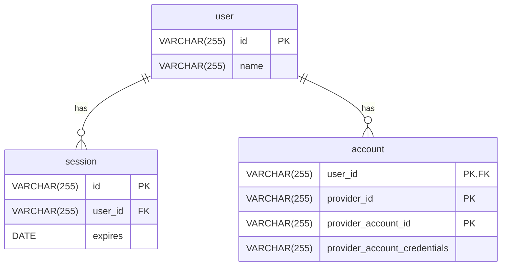

import { Callout, Steps } from 'nextra/components'

# User + Account + Session + Credentials

A minimal relationship between users, accounts, and sessions that also tracks **provider account credentials**.

This schema shares the same basic information as [User + Account + Session](/reference/database/schemas/1)

## Entity-Relationship Diagram

## Use Cases

### Username/password

`user` creates an `account` with username/password login.

### OAuth Refresh Token

`user` logs into OAuth `account`, and application will store access or refresh token.

For example `user` logs in via Google and generates Google refresh token.
Application will use refresh_token to access Google Drive to display their files.
