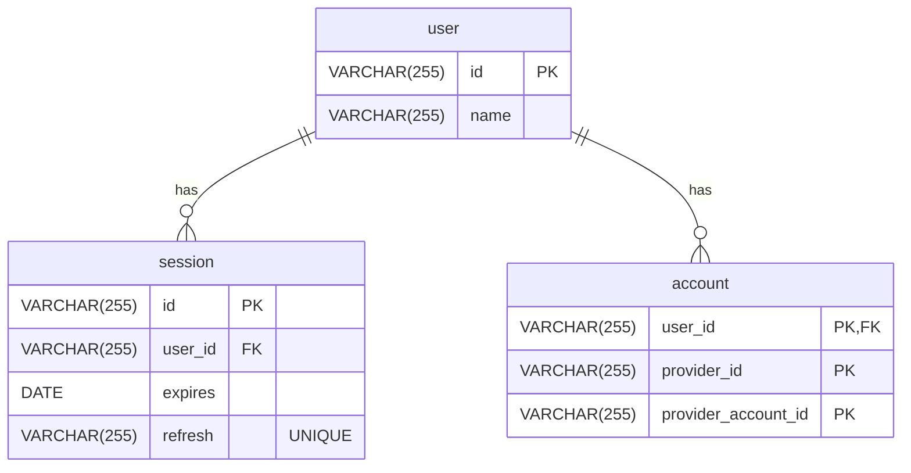

import { Steps } from 'nextra/components'

# User + Account + Session + Refresh

A minimal relationship between users, accounts, and sessions that also supports ***refresh tokens***.

This schema shares the same basic information as [User + Account + Session](/reference/database/schemas/1)

## Entity-Relationship Diagram

## Refresh Flow

Read more about the authentication flows [here](/reference/flows).

<Steps>

### User Logs In
After a user logs in, create a new session and attach a unique refresh code (e.g. UUID, CUID).
Store this this separately from the session (e.g. in a separate cookie).

The refresh information should be set to expire after the session information.
For example the session may expire after 1 day, and the refresh after 1 week.

### Session Expires

When the session expires, find and read the refresh information if it exists.
Find a corresponding session that has this unique refresh code.

### Refresh Session.

If valid refresh information was found:

1. Update its expiration date.
2. Generate a new, unique refresh code.
3. Store the new session and refresh information.
</Steps>

## Remarks

This guide does not elaborate on how to `DELETE` sessions from the database altogether.
It assumes that the session expires on the client, or through the database via the `expires` property.
