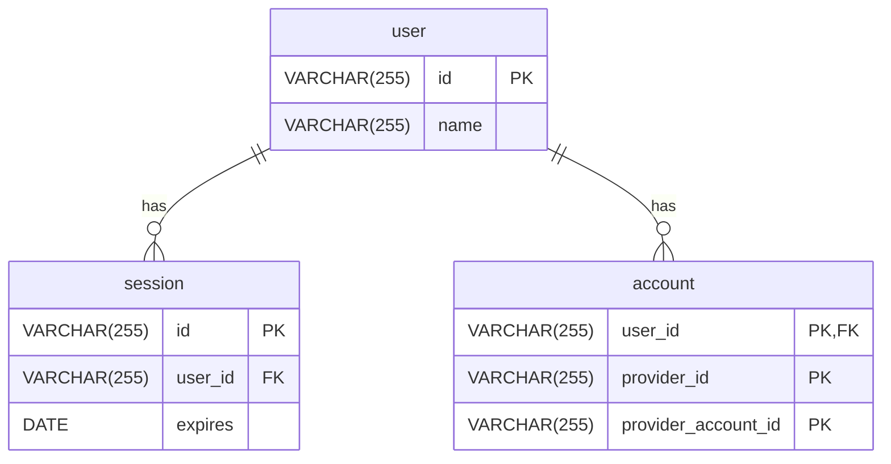

import { Callout, Steps } from 'nextra/components'

# User + Account + Session

A minimal relationship between users, accounts, and sessions.

## Entity-Relationship Diagram



## Relationships

### IDs

The unique ID used for `user` and `session` tables can be created using CUID or UUID.

### User

- A `user` can be visualized as a physical person.
- A `user` has zero or more `accounts`, which is a way for them to authenticate.
- A `user` has zero or more `sessions`, which represents a successful log in.

### Session

After a `user` successfully authenticates to one of their `accounts`, a new `session` should be created.

- A `session` should not be easily fingerprintable.
- A `session` should expire.
- A `session` needs to be associated with an existing `user`.

### Account

An `account` is uniquely identified by a `user_id`, `provider_id`, and `provider_account_id`.

- User ID: The owner of the account.
- Provider ID: The ID of the provider that will handle authentication.
- Provider Account ID: The ID of the user under that provider.

#### Examples

| user_id   | provider_id | provider_account_id |
| :-------- | :---------- | :------------------ |
| cuid_id_1 | auth0       |  user@auth0.com     |
| cuid_id_2 | battlenet   |  user@battlenet.com |
| cuid_id_3 | discord     |  user@discord.com   |


## Authentication Flows

### Sign Up (Google OAuth)

<Steps>

### Visit Login Page

User visits `/auth/login/google` to authenticate with Google OAuth.

### Complete OAuth approval

User gets redirected from application to Google OAuth page and approves application.

### Visit Callback Page

Google redirects user back to application, and application handles callback.

### Exchange OAuth code for token

After exchanging code for token, application gets information:

```json
{
  "sub": "12345"
}
```

### Handle Sign Up

Application ***does not*** find an `account` with `provider_id=Google` and `provider_account_id=12345`.
User is signed up.

</Steps>

### Log In (Google OAuth)

<Steps>

### Visit Login Page

User visits `/auth/login/google` to authenticate with Google OAuth.

### Complete OAuth approval

User gets redirected from application to Google OAuth page and approves application.

### Visit Callback Page

Google redirects user back to application, and application handles callback.

### Exchange OAuth code for token

After exchanging code for token, application gets information:

```json
{
  "sub": "12345"
}
```

### Handle Login

Application ***does** find an `account` with `provider_id=Google` and `provider_account_id=12345`.
</Steps>

<Callout type="info">
  The process of user and account creation, linking, etc. can be seen in the [flowchart](/reference/flows/default)
</Callout>


## Remarks

### Account Credentials

This minimal set up **does not handle provider account credentials**.
See [basic+credentials](/reference/database/schemas/basic+credentials) for an example with credentials.

#### Examples

A user logs in with username and password combination.

A user logs in via Google and generates a `refresh_token` for their account.
This can be stored in the database and used to access Google resources on the user's behalf.

| user_id   | provider_id | provider_account_id | provider_account_credential
| :-------- | :---------- | :------------------ | :--------------------------
| cuid_id_4 | credentials | user@email.com      | password
| cuid_id_5 | google      | user@gmail.com      | eyJhbGciOi...


### Refresh

This minimal set up **does not handle refresh**.
See [basic+refresh](/reference/database/schemas/basic+refresh) for an example with refresh behavior.

#### Concept

Attach a unique refresh code (e.g. UUID, CUID) to each session in the database,
and store this separately from the session (e.g. in a separate cookie).

The refresh information should be set to expire after the session information.
For example the session may expire after 1 day, and the refresh after 1 week.

When the session expires, find and read the refresh information if it exists.
Find a corresponding session that has this unique refresh code. If it exists:

1. Update its expiration date.
2. Generate a new, unique refresh code.
3. Store the new session and refresh information.

## External

### Schemas

- [basic+credentials: Store Provider Account Credentials](/reference/database/schemas/basic+credentials)
- [basic+refresh: Support Refresh Tokens](/reference/database/schemas/basic+refresh)

### Supporting Libraries

- [CUID](https://github.com/paralleldrive/cuid2)
