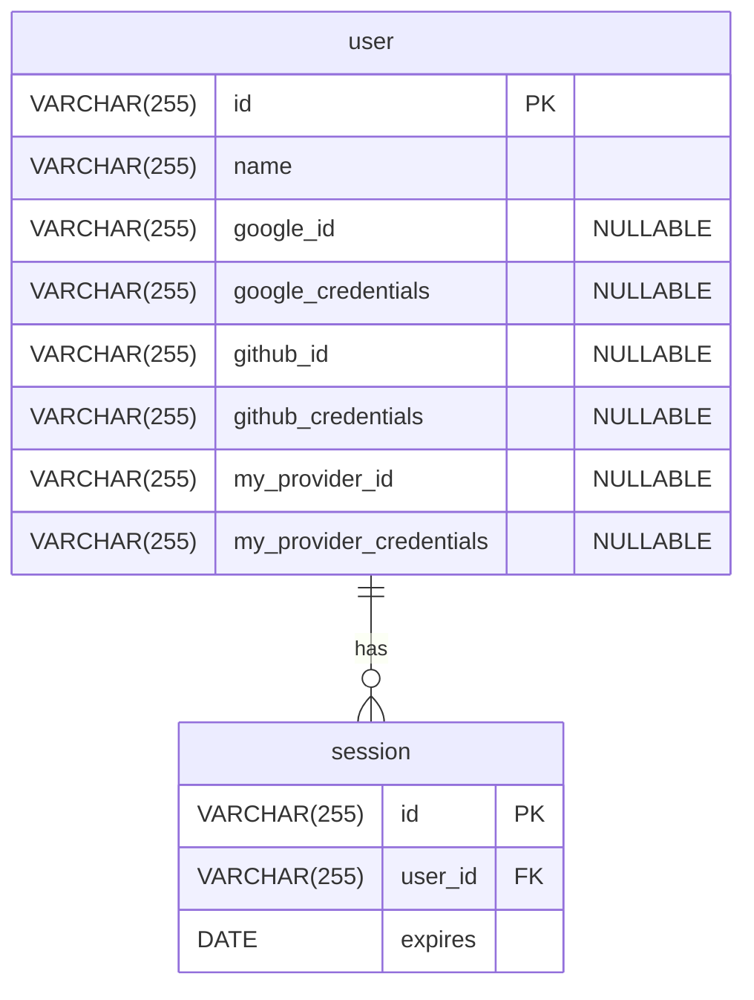

# User + Flagged Account + Session

Uses `user` and `session` tables like the [default strategy](/refrence/database/schemas/basic).
Omits the `account` table in favor of storing the information directly in the `user` table.

## Entity-Relationship Diagram

## Comparison to Default Schema

### Pros
- Less tables to maintain.
- Simpler to lookup accounts and users.

### Cons
- `user` gets larger.
- `nullable` fields for each account user does not have.
